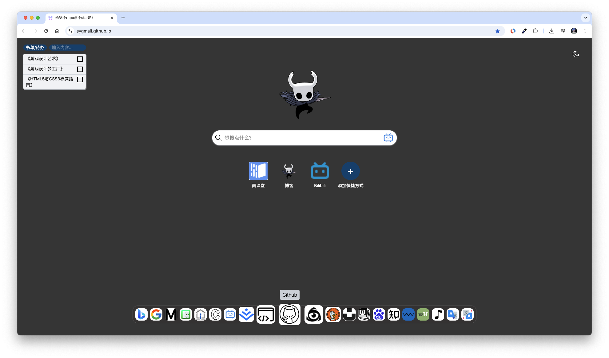
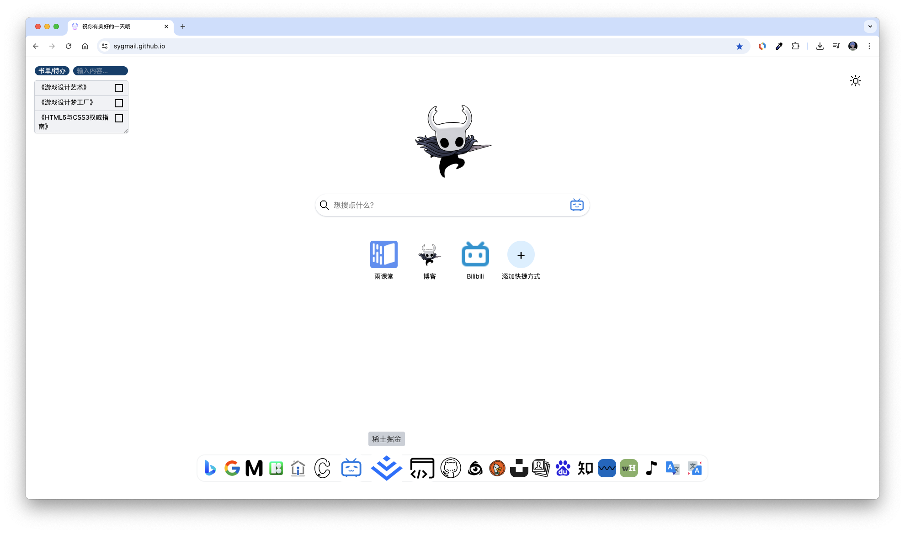

<p align="center">
 
 <h2 align="center">Syight Search Page</h2>
</p>

<p align="center">
  <a href="#">
    
  </a>
  <a href="#">
	  
  </a>
  <a href="#">
	  
  </a>
  <a href="#">
    
  </a>
</p>

- 💪 Vue 3 Composition API
- Simple UI like Google
- Smooth logic of mutulization

## Dark Theme


## Light Theme


## Getting Started

Install this project as a normal vue.

```sh
# clone the reporsitory
git clone git@github.com:SyGmail/SygamilSource.git
# enter the directory
cd SygmailSource
# install npm package
npm install
```

## Contributors

This project exists thanks to all the people who contribute.

And thank you to all our backers! 🙏

<a href="https://github.com/SyGmail/SygamilSource/graphs/contributors">
  
</a>

## Lisence
Syight-Search-Page is open source software licensed as [MIT](https://mit-license.org/).